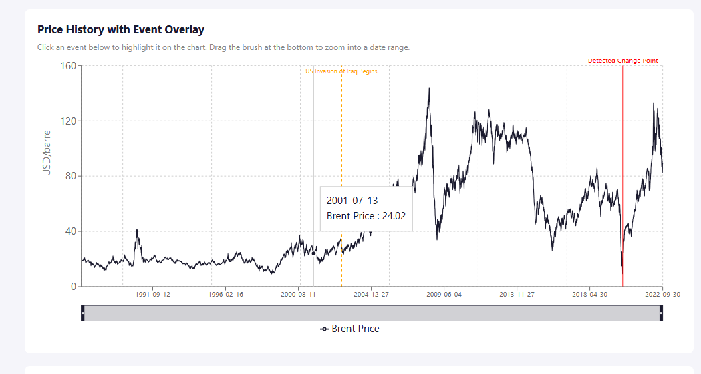
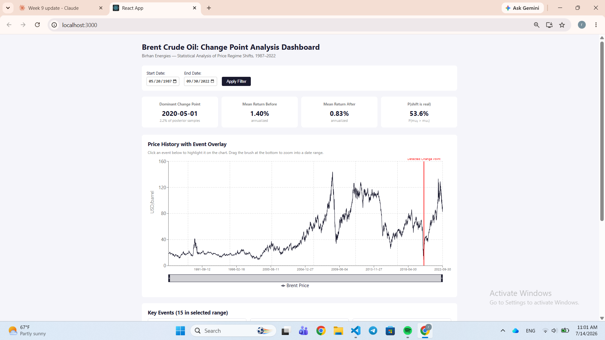
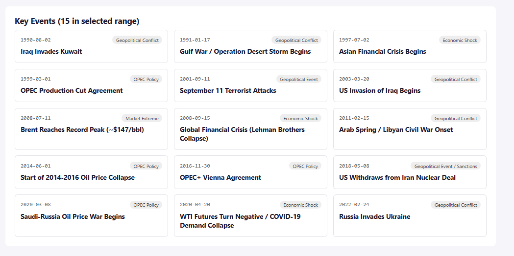

# Change Point Analysis of Brent Crude Oil Prices

**Client:** Birhan Energies  
**Program:** 10 Academy Kifiya AI Mastery Program — Week 10

## Overview

Birhan Energies helps investors, policymakers, and energy firms interpret market volatility in the oil sector. This project applies Bayesian change point detection to Brent crude oil prices to identify structural breaks and connect them to major geopolitical and economic events.

The goal is not only to detect regime shifts in price behavior, but also to translate statistical results into actionable business insights for energy market stakeholders.

## Business Context

Oil markets are highly sensitive to global events such as:
- geopolitical conflicts
- OPEC decisions
- pandemics and demand shocks
- macroeconomic policy shifts

By analyzing Brent crude oil prices through a change point lens, this project seeks to uncover periods where the market’s behavior shifted materially and explain those transitions in the context of real-world events.

## Project Objectives

This repository aims to:
- explore historical Brent crude oil price behavior
- identify structural breaks in price dynamics
- evaluate whether observed shifts are driven by changes in mean return or volatility
- associate detected change points with major historical events
- deliver an interactive dashboard for visual exploration

## Dataset

The analysis uses daily Brent crude oil prices (USD/barrel) from:
- **Period:** May 20, 1987 to September 30, 2022
- **Size:** 8,980 trading days

The dataset is stored in:
- `data/raw/BrentOilPrices.csv`

## Project Structure

```text
brent-oil-change-point-analysis/
├── .github/workflows/         # CI/CD configuration
├── data/
│   ├── raw/                   # Original BrentOilPrices.csv
│   └── processed/             # cleaned data, key_events.csv
├── notebooks/
│   └── 1.0-eda.ipynb         # Task 1: EDA, stationarity, volatility analysis
├── src/                       # Reusable Python source code
├── tests/                     # Unit tests
├── scripts/                   # Utility scripts
├── docs/
│   └── Task1_Analysis_Workflow.docx
├── dashboard/
│   ├── backend/               # Flask API
│   └── frontend/              # React dashboard
├── requirements.txt
└── README.md
```

## Setup

### 1) Create and activate a virtual environment

```powershell
python -m venv venv
.\venv\Scripts\Activate.ps1
```

### 2) Install dependencies

```powershell
pip install -r requirements.txt
```

### 3) Register the environment with Jupyter

```powershell
python -m ipykernel install --user --name=brent-venv --display-name "Python (brent-oil-analysis)"
```

## Methodology

### Task 1 — Foundation and Exploratory Analysis
This stage focused on preparing the dataset and building an analytical foundation.

Key activities included:
- compiling a curated list of 15 major geopolitical, OPEC, and economic events
- mapping events to relevant dates in `data/processed/key_events.csv`
- visualizing the raw price series
- analyzing log returns and rolling volatility
- testing stationarity using the ADF test

Key insights:
- raw price levels were non-stationary
- log returns were stationary
- this supported modeling log returns rather than raw price levels

### Task 2 — Bayesian Change Point Modeling
A Bayesian approach was used to detect structural changes in the return behavior of Brent crude oil prices.

Modeling approach:
- discrete uniform prior over the change point location
- separate mean parameters before and after the change point
- Gaussian likelihood using a switching formulation
- MCMC sampling with NUTS and Metropolis steps

Results:
- the posterior distribution for the change point showed a dominant mode around early May 2020
- this timing aligns with the Saudi-Russia oil price war and the COVID-19 demand collapse
- a secondary cluster appeared around May–June 2022, consistent with the aftermath of the Russia-Ukraine invasion

Important interpretation:
- the evidence was stronger for a volatility regime shift than for a clear directional mean-return shift
- this limitation motivates future work involving multi-change-point or regime-switching variance models

### Task 3 — Interactive Dashboard
A web-based dashboard was built to make the analysis accessible and interactive.

The dashboard includes:
- historical price visualization
- change point reference lines
- event markers
- date-range filtering
- summary metrics
- click-based event exploration

## Dashboard Usage

### Start the backend

```powershell
cd dashboard\backend
python app.py
```

### Start the frontend

```powershell
cd dashboard\frontend
npm start
```

Then open:

```text
http://localhost:3000
```

## Key Technical Notes

- The source CSV contained inconsistent date formats, which were resolved using `pd.to_datetime(..., format="mixed")`
- The dataset was trimmed to the end date specified in the project brief
- The workflow was designed to be practical in a low-RAM environment through incremental and chunk-aware processing where needed
## Screenshots

The dashboard screenshots are available in the `docs/dashboard_screenshots/` folder:

## Screenshots

The dashboard screenshots are available in the `docs/dashboard_screenshots/` folder:







## Key Findings

- Brent crude oil prices exhibit clear structural shifts over time
- The most prominent change point appears to coincide with the 2020 energy market shock
- The analysis suggests that volatility dynamics may be more informative than simple mean return changes
- Major external events appear to be relevant, though statistical evidence does not imply causation by itself

## Reproducibility

To reproduce the analysis:
1. install dependencies
2. open and run the notebook in `notebooks/1.0-eda.ipynb`
3. run the Bayesian modeling workflow from the relevant script or notebook
4. launch the dashboard locally

## Author

**Rebika Woldeyesus**  
10 Academy Kifiya AI Mastery Program — Week 10